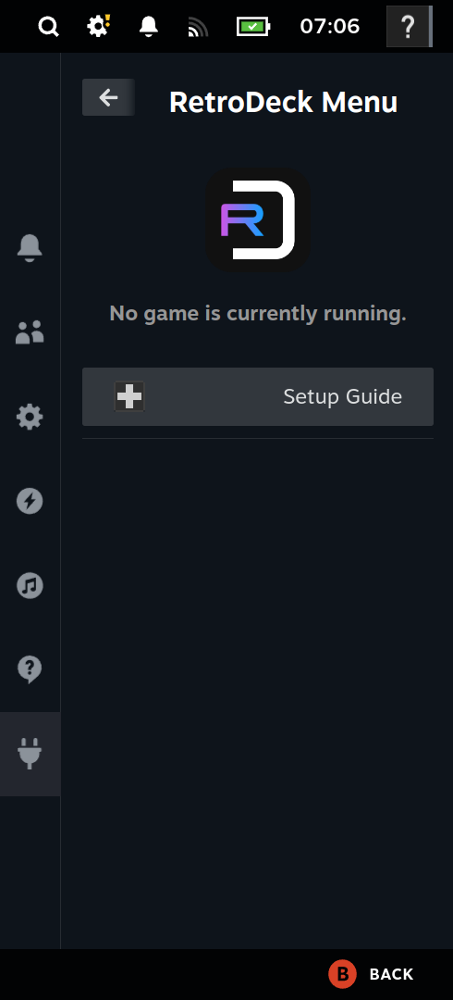
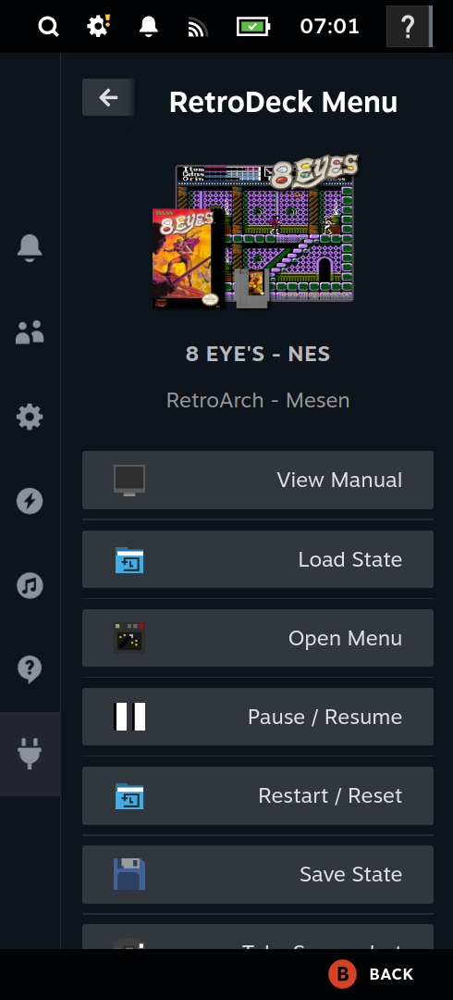

# RetroDeck Menu
An Ingame Menu for RetroDeck as Decky Plugin.

<p float="left">


</p>

## Features
- **Game Information Display** - Shows current game details including name, system, emulator, and cover art
- **Emulator Actions** - Execute hotkeys and commands for various emulators without leaving gaming mode
- **PDF Manual Viewer** - View game manuals directly in the plugin interface
- **Action Categories** - Organized actions by category (Quick, Display/Graphics, State, Speed/Frames, etc.)
- **Multi-Emulator Support** - Supports 21+ emulators including RetroArch, Dolphin, PCSX2, PPSSPP, RPCS3, and more
- **System-Specific Actions** - Context-aware actions that adapt based on the running game and emulator

## Plugin Setup
1. You can install the Plugin in the following ways:
    1. Download the plugin from the **Decky Plugin Store** (Not available yet)
    2. Install the plugin from the **releases page**
    3. **Build the plugin yourself**
2. Ensure **RetroDeck Flatpak** is installed on your system
    1. If not installed, you can install it via the **Discover Store** or run: `flatpak install --user flathub net.retrodeck.retrodeck`
3. Open RetroDeck Menu in the **Steam Quick Access Menu**
4. Follow the **Setup Guide** displayed in the plugin menu:
    1. The plugin will automatically check if RetroDeck is installed
    2. The plugin will create ES-DE event scripts automatically
    3. You need to enable **Custom Event Scripts** in RetroDeck:
        - Open RetroDeck and navigate to **ES-DE Configurations > Other Settings**
        - Enable **Custom Event Scripts**
        - **Restart** RetroDeck
5. To reload the setup status, go to **Decky Settings > Plugins > RetroDeck Menu > Reload**

## Known Issues
1. Hotkeys which require holding keys like Fast Forward may not work properly yet

## How It Works
The plugin integrates with RetroDeck through ES-DE event scripts:

### Game Event Detection
1. When a game starts in RetroDeck, ES-DE executes a custom event script
2. The script sends game information to the plugin's backend server
3. The plugin receives the game event and displays it in the menu
4. Actions are filtered based on the current game's system and emulator

### Action Execution
1. Actions can be **hotkey-based** (sending keyboard shortcuts to the emulator) or **builtin** (plugin-specific functions)
2. Hotkey actions are sent directly to the active emulator window
3. Builtin actions include:
   - **View Manual**: Opens the game's PDF manual in the plugin's PDF viewer
   - **Exit**: Closes the current emulator/game window

### Media Resolution
1. The plugin automatically resolves game cover art and manual paths from ES-DE's media directories
2. It checks for miximages, covers, and manuals in the appropriate system folders
3. Media is served through a local HTTP server for display in the plugin

## Building and Deployment

To properly build and deploy the plugin manually please refer to this guide: https://magicpods.app/blog/post-11/

### Development Setup
1. Install dependencies:
   ```bash
   pnpm install
   pip install -r requirements.txt -t py_modules --upgrade
   ```
2. Build the frontend:
   ```bash
   pnpm run build
   ```
3. Generate actions (if modifying actions):
   ```bash
   pnpm run generate-actions
   ```

## Acknowledgments
1. Built using the [Decky Plugin Template](https://github.com/SteamDeckHomebrew/decky-plugin-template)
2. Integrates with [RetroDeck](https://github.com/XargonWan/RetroDeck) and [ES-DE](https://www.es-de.org/)
3. Uses [pdfjs-dist](https://github.com/mozilla/pdf.js) for PDF manual viewing
